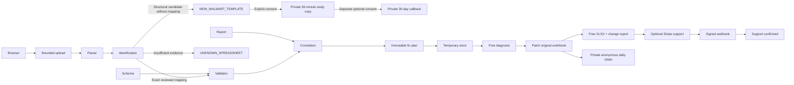

# FeedFix architecture

## Modules and order
| Module | Responsibility | Depends on |
| --- | --- | --- |
| engine | Schema, parse, validate, issues, plan, surgical OOXML changes | — |
| web | Landing, upload, free diagnosis | engine |
| payment | Optional support Checkout and signed webhook | engine, temporary state |
| hardening | Bounds, deletion, rate limits, errors, analytics | all |
Build and verify in that order. TypeScript strict; server-only workbook dependencies. Next.js App Router, React, CSS/Tailwind, Zod, Vitest and Playwright. Small pure functions; engine never knows HTTP or Stripe.

## Workbook library decision
ExcelJS is useful for fixture generation and independent preservation tests. It reads/writes many styles, sheets and formulas, but its object-model roundtrip is not a promise to preserve arbitrary OOXML extensions and unknown metadata. It is not sufficient as the production writer for this requirement.
Use adm-zip as the ZIP container, bounded raw inflation before parsing, and fast-xml-parser for read-only interpretation. Patch only selected simple cell elements into inline strings in the original worksheet XML, leaving other XML bytes intact. Preserve every untouched archive member's uncompressed bytes. ZIP container compression/metadata may change. Never rebuild a workbook. Refuse formulas, rich strings, merged cells and non-simple cells as automatic fix targets. Retain original bytes separately; apply preconditions and reject stale/conflicting plans. ExcelJS remains dev-only.
Sources: [ExcelJS](https://github.com/exceljs/exceljs), [adm-zip](https://github.com/cthackers/adm-zip).

## Schemas and reports
MarketplaceSchema has explicit sheet, header row, marker, fields and provenance. Fields declare constraints and allowed normalizations. No guessed Walmart aliases or enums. Register reviewed JSON through SCHEMA_PATH; Zod validates configuration. A synthetic adapter is the initial example. ProcessingReportParser maps declared CSV/XLSX report headings to ExternalIssue; exact correlations only, duplicate SKUs are ambiguous. External messages remain untrusted and are rendered as text. Explicit reviewed support codes classify Walmart Support; unknown errors need input, not guessed categorization.
Needed before real launch: original blank XLSX exported from Seller Center (US marketplace, exact item setup category and version), corresponding official schema/requirements with required/conditional fields and enums, populated fictitious version, actual report layout with redacted errors and code documentation, and a roundtrip import test in Seller Center. Record provenance URLs and review date. API schemas alone do not establish spreadsheet header mappings. [Walmart versioning](https://developer.walmart.com/us-marketplace/docs/item-spec-versioning-and-diff-reporting).

## State and privacy
Single Node process, one replica, persistent mounted local volume; no database. TemporaryFileStore persists an atomic JSON record containing original bytes, issues, plan, opaque capability hash, expiry and payment state. Directory 0700/files 0600. Mutations serialized per process; atomic rename handles crash consistency. Restart preserves pending analyses and paid state. All spreadsheet-bearing records expire after at most 59 minutes; an in-process 30-second sweep plus startup/request cleanup enforces deletion while service runs. Mounted storage must not have backups/snapshots. When stopped no software cleanup can run: deployment must retain lifecycle cleanup or purge expired records before accepting traffic. No training, no AI calls, no routine manual access, no content logging. JSON change report expires too.
Production minimum is one always-on Node instance with a private volume and HTTPS, not serverless/multiple replicas. Memory-only loses in-progress work on restart; SQLite adds no benefit for this serialized V0. Object storage adapter must provide conditional updates and lifecycle deletion before replacing local state. No unsupported claim that local storage works across replicas.

## Payments
Random analysis ID and separate 256-bit bearer token; store token hash. Token stays in browser sessionStorage, sent in Authorization header, never Stripe metadata or query parameters. Stripe metadata holds only analysis ID. Server derives price/plan, creates idempotent Checkout, verifies signed raw webhook plus session ID, USD amount, mode, payment status. Only webhook sets PAID. Replays are safe. Generation is free and deterministic; PAID only records optional support and never controls download access. Late payments are refunded through Stripe with an idempotency key; no delayed payment methods. Checkout return page polls authenticated state; redirects never grant access. Test payment adapter requires non-production NODE_ENV and explicit PAYMENT_MODE=mock; it still exercises the signed webhook handler.
[Stripe fulfillment](https://docs.stripe.com/checkout/fulfillment), [Next route handlers](https://nextjs.org/docs/app/getting-started/route-handlers).

## Security
Bound request bytes while streaming before FormData parsing; extension/MIME/signature checks, ZIP count/size/ratio limits and bounded inflate, no extraction, traversal/duplicate/encrypted/macro/external-link rejection. Reject XML DTD/entities, unsafe formula families and embedded executable content; never evaluate formulas. Limit rows/cells/issues and global retained bytes/count. IP rate limits use a trusted proxy header only if configured; otherwise a shared conservative bucket. Same-origin mutations, no-store sensitive responses, nosniff/referrer/frame security headers. Capability-based expiring downloads; fixed server filenames. Never export untrusted values as formulas: JSON report and explicit inline strings.

## Deployment choice
Recommend Railway Docker service + private volume, one replica, no sleep, request limit configured at edge; budget resources for bounded XLSX work (start 1GB RAM). Render paid web service + disk is comparable. Fly.io machine + volume works but adds operational decisions. Vercel functions are not the initial choice: ephemeral filesystem, request limits and independent webhook invocations conflict with local state and 25MB uploads. Validate current provider limits/cost before buying. No deployment or paid provisioning performed automatically.
[Railway volumes](https://docs.railway.com/volumes), [Render disks](https://render.com/docs/disks).

## Testing
Vitest pure rule matrix, synthetic XLSX, independent ExcelJS reread, byte comparisons of all untouched ZIP entries, security regressions, server lifecycle and signed mock payment. Playwright actual HTTP upload and mocked-provider checkout; no real Stripe charges in CI. Production build plus lint/typecheck. No test bypass endpoint available in production.

## Implementation limits made explicit
The first schema adapter validates one declared item worksheet. Additional worksheets are preserved and security-checked, but catalog rows in them are not validated. Conditional requiredness and cross-sheet variant families are not supported. Field requirements must be unconditional in the reviewed adapter; do not advertise full category validation if omitted requirements matter. ZIP members over 16MB, total expansion over 64MB, >2,000 entries, >30 sheets, >150,000 cells or >10,000 items are refused. Two simultaneous upload requests are admitted, with engine/payment state mutations serialized. Download streaming is not yet optimized for much larger workbooks.

Checkout expiry is derived from analysis creation (45 minutes), making retries use identical Stripe idempotency parameters even if the process restarts before persisting the response. The excluded payment method list reduces delayed methods; any late successful payment still takes the refund path. Configure the Stripe Dashboard methods for this short-retention product and test in that account before live launch.

UI concept deviations: use the requested two-line hero and narrower utility column; correct the generated concept's erroneous PDF/TXT suggestion to XLSX/CSV; add a visible synthetic-preview disclosure and the requested configurable price. No concept image is shipped in the application. Browser plugin unavailable, so runtime QA uses Playwright Chromium.

Stripe calls use a 10-second timeout and one network retry to bound payment waits and avoid blocking temporary-store cleanup indefinitely. Production CSP omits unsafe-eval; inline script allowance is retained for Next hydration. HTTPS termination must supply transport security headers appropriate to the deployment domain.

## Free-download experiment and correction accounting
The user changed monetization to free downloads plus voluntary support. Full proposed corrections and JSON reports are free. Signed Checkout confirmation records support only; cancellation, absent Stripe credentials and unpaid status cannot block downloading. Local mock support remains unavailable in production. Synthetic records still cannot receive real money.

UsageLog stores a separate private atomic JSON snapshot at USAGE_LOG_PATH (Docker default /data/metrics/usage.json). Daily UTC real/synthetic corrected_files and corrections totals persist without spreadsheets. File sync plus atomic rename writes the increment and its deduplication receipt together; the shared single-process mutation lock serializes downloads. Hashes of random analysis IDs are used only as temporary receipts, pruned with analysis expiry. Receipts store no user/file content. If a process stops between logging and updating analysis.generated, a retry finds the receipt and does not double count. A failed log write emits correction_log_write_failed and still returns the file; a later download retries accounting. Such failures can cause undercounting if no retry occurs, so monitor that event. This metric counts server generation, not completed transport or Walmart acceptance.

The existing 30-second cleanup also removes expired metric receipts while leaving aggregate daily counts. CLI npm run stats reads an atomic snapshot and prints totals/daily breakdown only; it does not expose temporary receipts or mutate the log. Keep one replica, private volume, and the metrics path outside the temporary spreadsheet directory. No database, public metrics endpoint or dashboard is introduced. Optional YES/NO/NOT_YET feedback is attributed to the UTC day of generation; edits replace the prior outcome rather than adding another case. Aggregates are explicitly user-reported and do not establish Walmart verification.

Railway implementation: `.railway/railway.ts` uses the official TypeScript SDK with a Dockerfile builder, one replica, required `/data` volume, no sleep and zero deployment overlap. The entrypoint drops root after initializing mount permissions. `/api/health` checks directory access and starts cleanup. A bundled `stats.cjs` exposes only aggregate counts inside the container. See [RAILWAY.md](RAILWAY.md) for deployment and rollback.

## Official schema compiler update

The original schema-adapter limitations above describe V0. The official schema integration now preserves draft-07 field/array/conditional rules in a deterministic shared graph, uses explicit Excel mappings and whole-feed validation, verifies workbook structure after repair and gates support on current golden evidence. See [walmart-schema-integration.md](docs/walmart-schema-integration.md) for the current architecture and remaining mapping/real-workbook limitations.

## Explicit upload outcomes
`inspectUpload` runs the existing guarded OOXML parser before looking up a mapping. `matchTemplate` reuses validator header checks and throws a distinct `UnsupportedTemplateError`; only that mismatch enters structural identification. Configuration errors and validation/repair errors are not swallowed as new templates. With no production mapping, safe uploads can still be identified, without enabling synthetic mappings. `identifyWalmartWorkbook` checks the MP_ITEM version marker, Data Definitions headers, hidden metadata sheet and canonical core field headers together. Its observations come from the local legacy layout; it intentionally misses unfamiliar conventions rather than infer mappings. Sheet visibility is read-only parser metadata.

`POST /api/analyze` has a discriminated result: `SUPPORTED` retains `analysis` and `token`; `NEW_WALMART_TEMPLATE` and `UNKNOWN_SPREADSHEET` return booleans `walmartDetected`, `supported:false`, `modified:false`, `studyShareAvailable`, `checkoutAvailable:false`, plus the existing contribution receipt. No analysis/token/plan/schema or template fingerprint is returned for either unsupported state. Invalid workbook parsing returns HTTP 400 `INVALID_OR_UNSAFE_FILE`; other request/configuration failures remain errors (`REQUEST_FAILED`), not successful template results.

`POST /api/study-share` reuploads the browser-held original with `studyConsent`, repeats all security/identification checks, requires a new candidate and current consent, then calls the existing ContributionStore. Without opt-in, unknown bytes exist only in request memory, not retained server-side. The study copy's `templateIdentity` is a private header-only fingerprint plus declared version, never a production mapping. All private reports retain the original one-hour policy.

`TemplateNotificationRequests` isolates the small local callback store. `POST /api/template-notification` validates a <=1 KiB strict JSON request containing email, consent version, study ID and deletion token. A still-live consented study copy authorizes the request; the server computes the layout key. A single atomic private JSON per study, max 1,000 records, expires within 30 days and survives workbook expiry. No raw file bytes/headers/merchant rows enter this store. Same-origin checks, bounded bodies, global rate limiting and a separate 10/minute notification bucket apply. Repeating the same request is idempotent without extending expiry; changing its address requires deletion first. `POST /api/notification-delete/<studyId>` accepts the private token even after workbook deletion. No email/list/read API or email transport exists. Only the existing single-instance filesystem/queue is used; no database or new service.

See [workbook-study-copies.md](docs/workbook-study-copies.md) for retention, backup exclusions and the human approval path. New-template analytics are property-free; the existing strict property allowlist still filters all event payloads. The uploader/results and email UI retain defensive masking attributes. Global Clarity/GA injection is removed for Decoder privacy; private data never enters the events endpoint.

## Pre-upload decoder boundary
`src/decoder/knowledge.ts` owns audited static guidance and server classification. The UI imports only the small input/redaction helper and the shared response type. The existing HTTP dispatcher supplies bounded JSON, origin checking, independent rate limits and safe no-store failures. Decode has no storage side effect; a separate explicit-consent share call reclassifies/redacts and writes UnknownErrorStore under the existing exclusive queue. Startup/30-second sweeps expire that independent 7-day store. The engine, mappings, compiled schemas, goldens and contribution receipts are unchanged.

The landing renders the decoder before its existing upload region. CTA only focuses that region; all supported/new-template/unknown/unsafe outcomes still use the existing components. Global third-party scripts are removed to keep same-document pasted text private. Stable entry slugs reserve future public content boundaries without new routes or user-content indexing. See [contract, source policy, privacy and limitations](docs/error-decoder.md) and [analytics](docs/analytics.md).

Error-message storage requires idempotent redaction: the server rejects submitted text that differs from its sanitized form. The browser displays and submits the final preview, resetting consent after edits. Normalization and redaction expansion cannot exceed the message bound. See the privacy hardening verification report.
