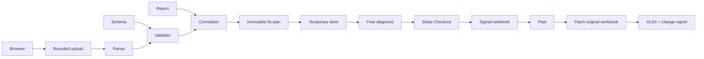

# FeedFix architecture

## Modules and order
| Module | Responsibility | Depends on |
| --- | --- | --- |
| engine | Schema, parse, validate, issues, plan, surgical OOXML changes | — |
| web | Landing, upload, free diagnosis | engine |
| payment | Checkout, signed webhook, paid downloads | engine, temporary state |
| hardening | Bounds, deletion, rate limits, errors, analytics | all |
Build and verify in that order. TypeScript strict; server-only workbook dependencies. Next.js App Router, React, CSS/Tailwind, Zod, Vitest and Playwright. Small pure functions; engine never knows HTTP or Stripe.

## Workbook library decision
ExcelJS is useful for fixture generation and independent preservation tests. It reads/writes many styles, sheets and formulas, but its object-model roundtrip is not a promise to preserve arbitrary OOXML extensions and unknown metadata. It is not sufficient as the production writer for this requirement.
Use adm-zip as the ZIP container, bounded raw inflation before parsing, and fast-xml-parser for read-only interpretation. Patch only selected simple cell elements into inline strings in the original worksheet XML, leaving other XML bytes intact. Preserve every untouched archive member's uncompressed bytes. ZIP container compression/metadata may change. Never rebuild a workbook. Refuse formulas, rich strings, merged cells and non-simple cells as automatic fix targets. Retain original bytes separately; apply preconditions and reject stale/conflicting plans. ExcelJS remains dev-only.
Sources: [ExcelJS](https://github.com/exceljs/exceljs), [adm-zip](https://github.com/cthackers/adm-zip).

## Schemas and reports
MarketplaceSchema has explicit sheet, header row, marker, fields and provenance. Fields declare constraints and allowed normalizations. No guessed Walmart aliases or enums. Register reviewed JSON through SCHEMA_PATH; Zod validates configuration. A synthetic adapter is the initial example. ProcessingReportParser maps declared CSV/XLSX report headings to ExternalIssue; exact correlations only, duplicate SKUs are ambiguous. External messages remain untrusted and are rendered as text. Explicit reviewed support codes classify Walmart Support; unknown errors need input, not guessed categorization.
Needed before real launch: original blank XLSX exported from Seller Center (US marketplace, exact item setup category and version), corresponding official schema/requirements with required/conditional fields and enums, populated fictitious version, actual report layout with redacted errors and code documentation, and a roundtrip import test in Seller Center. Record provenance URLs and review date. API schemas alone do not establish spreadsheet header mappings. [Walmart versioning](https://developer.walmart.com/us-marketplace/docs/item-spec-versioning-and-diff-reporting).

## State and privacy
Single Node process, one replica, persistent mounted local volume; no database. TemporaryFileStore persists an atomic JSON record containing original bytes, issues, plan, opaque capability hash, expiry and payment state. Directory 0700/files 0600. Mutations serialized per process; atomic rename handles crash consistency. Restart preserves pending analyses and paid state. All spreadsheet-bearing records expire after at most 59 minutes; an in-process 30-second sweep plus startup/request cleanup enforces deletion while service runs. Mounted storage must not have backups/snapshots. When stopped no software cleanup can run: deployment must retain lifecycle cleanup or purge expired records before accepting traffic. No training, no AI calls, no routine manual access, no content logging. JSON change report expires too.
Production minimum is one always-on Node instance with a private volume and HTTPS, not serverless/multiple replicas. Memory-only loses paid work on restart; SQLite adds no benefit for this serialized V0. Object storage adapter must provide conditional updates and lifecycle deletion before replacing local state. No unsupported claim that local storage works across replicas.

## Payments
Random analysis ID and separate 256-bit bearer token; store token hash. Token stays in browser sessionStorage, sent in Authorization header, never Stripe metadata or query parameters. Stripe metadata holds only analysis ID. Server derives price/plan, creates idempotent Checkout, verifies signed raw webhook plus session ID, USD amount, mode, payment status. Only webhook sets PAID. Replays are safe. Paid generation is deterministic and idempotent. Late payments are refunded through Stripe with an idempotency key; no delayed payment methods. Checkout return page polls authenticated state; redirects never grant access. Test payment adapter requires non-production NODE_ENV and explicit PAYMENT_MODE=mock; it still exercises the signed webhook handler.
[Stripe fulfillment](https://docs.stripe.com/checkout/fulfillment), [Next route handlers](https://nextjs.org/docs/app/getting-started/route-handlers).

## Security
Bound request bytes while streaming before FormData parsing; extension/MIME/signature checks, ZIP count/size/ratio limits and bounded inflate, no extraction, traversal/duplicate/encrypted/macro/external-link rejection. Reject XML DTD/entities, unsafe formula families and embedded executable content; never evaluate formulas. Limit rows/cells/issues and global retained bytes/count. IP rate limits use a trusted proxy header only if configured; otherwise a shared conservative bucket. Same-origin mutations, no-store sensitive responses, nosniff/referrer/frame security headers. Capability-based expiring downloads; fixed server filenames. Never export untrusted values as formulas: JSON report and explicit inline strings.

## Deployment choice
Recommend Railway Docker service + private volume, one replica, no sleep, request limit configured at edge; budget resources for bounded XLSX work (start 1GB RAM). Render paid web service + disk is comparable. Fly.io machine + volume works but adds operational decisions. Vercel functions are not the initial choice: ephemeral filesystem, request limits and independent webhook invocations conflict with local state and 25MB uploads. Validate current provider limits/cost before buying. No deployment or paid provisioning performed automatically.
[Railway volumes](https://docs.railway.com/volumes), [Render disks](https://render.com/docs/disks).

## Testing
Vitest pure rule matrix, synthetic XLSX, independent ExcelJS reread, byte comparisons of all untouched ZIP entries, security regressions, server lifecycle and signed mock payment. Playwright actual HTTP upload and mocked-provider checkout; no real Stripe charges in CI. Production build plus lint/typecheck. No test bypass endpoint available in production.
